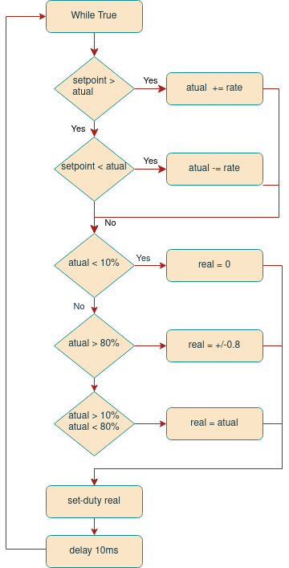

# RS485 Interface Commands and Documentation

## Context
### Board
This interface is intended, and only compatible with, the custom 410_LACEP revision of the VESC Controller.

### Parameters
The interface consists of an RS485 physical layer, using one differential pair. The data is transferred on a half-duplex serial UART running at **115200 baud**. 

### Command Structure
Each command consists of the *controller_id* a *command_name* and an optional sequence of *args* separated by *whitespace* and terminated with newline (\\n). 

```
<controller_id> <command_name> <args>\n
```
All directed commands return a *response* terminated by a single newline (\\n).
```
<controller_id> <response>\n
```
Some *command_names* are available in short form (the first letter). 

There is a *broadcast id* `*` that sends a command to all motors, but doesn't return any response.

In case a command does not match any on the list a error *response* will be returned `CMD_NOT_FOUND`.

Checkout the `test.py` file to see a Class that implements the communication and runs a battery of tests.

```shell
usage: python3 test.py
       [-h] [--duty] [--encoder] [--temperature] [--all]
       [--show] [--plot] [--forever] [--count COUNT]
       port
```
Example:
```shell
python3 test.py --plot --all --count 1 
```
Will run the following sequence:
 - **Ramp** to the maximum duty cycle actuating both motors sequentially
 - **Ramp** to the maximum inverted  duty cycle (runs in reverse) actuating both motors sequentially
 - **Ramp** to stop both motors using the *broadcast id*.
 - Run the motors in 0.3 duty cycle, while polling the encoder
 - Read motor and MOSFET temperatures individually and with the combined `temp` command
 - Plot the captured encoder data using `matplotlib`

The script also depends on `numpy`

### Limitations
Preliminary tests have encountered problems running the board on the extremes of the possible range of control.
The following figure is the plot of a "VESC Motor Experiment" sweeping the duty cycle from 0% to 100%.


The x-axis is correlated with the duty cycle. The duty cycle is incremented by 2% every 3 seconds. So the start of the usable band is at around 24s, divide by 3, so 8 steps totalling 16%. The upper limit is also identified at 84%. **So the usable duty cycle range is from 16%-84%**. The interface limits the actual duty cycle applied to the motor to the interval 10%-80% (in forward and reverse). 

## Command List
### Duty Cycle Control
#### Set Duty Cycle with Ramp 

- Usage: `<id> duty <setpoint>`
- Short form: `d` 
- Sets the target duty cycle to *setpoint*. The controller will then close the distance by adding the value of `rate` every 10ms. 
- Response: Expected time to *setpoint* in seconds
- Example: `0 duty 0.3`

#### Set rate 
- Usage: `<id> rate <value>`
- Sets delta (in %) that the duty cycle will jump every 10ms
- Note: Setting the rate to >0.10 will cause oscillations when passing through the duty cycle deadzone (+/- 10%).
- Example: `0 rate 0.02`

### Encoder
#### Read Encoder Count

- Usage: `<id> encoder`
- Short form: `e`
- Gets current encoder position in degrees
- Response: `216.40`

#### Reset Encoder Count

- Usage: `<id> reset_encoder`
- Short form: `r`
- Rests current encoder count.
- Response: `0`

### Temperature
#### Read Temperature Sensors

- Usage: `<id> temp`
- Short form: `t`
- Returns current temperature of motor and MOSFET in degree Celsius, separated by a comma.

#### Read Motor Temperature Sensor

- Usage: `<id> temp_motor`
- Returns only the motor temperature in degree Celsius.

#### Read MOSFET Temperature Sensor

- Usage: `<id> temp_mosfet`
- Returns only the MOSFET temperature in degree Celsius.


## Duty Cycle Thread Logic
The interface architecture is divided in two threads. One responsible to ingest, parse and respond to commands (*Commands Thread*) and another to update the motor duty cycle (*Duty Cycle Thread*). The Duty Cycle Thread is the most important and its general logic is displayed in the following flowchart diagram:

