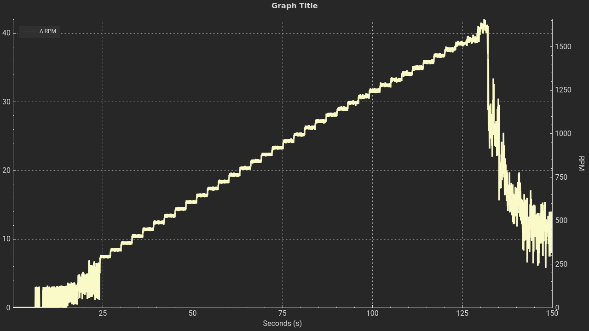

# RS485 Interface Commands and Documentation

## Context
### Board
This interface is intended, and only compatible with, the custom 410_LACEP revision of the VESC Controller.

### Parameters
The interface consists of an RS485 physical layer, using one differential pair. The data is transferred on a half-duplex serial UART running at **115200 baud**. 

### Command Structure
Each command consists of a *command_name* and an optional sequence of *args* separated by *whitespace* and terminated with a *newline* (\\n). 

```
<command_name> <args>\n
```
All commands return a *response* terminated by a carriage-return and newline (\\r\\n).
```
<response>\r\n
```
Upper/lower case is irrelevant.

### Limitations
Preliminary tests have encountered problems running the board on the extremes of the possible range of control.
The following figure is the plot of a "VESC Motor Experiment" sweeping the duty cycle from 0% to 100%.



The x-axis is correlated with the duty cycle. The duty cycle is incremented by 2% every 3 seconds. So the start of the usable band is at around 24s, divide by 3, so 8 steps totalling 16%. The upper limit is also identified at 84%. **So the usable duty cycle range is from 16%-84%**.   

## Command List
### Duty Cycle Control
<details open>
    <summary>
        duty 
    </summary>

- Usage: `duty <setpoint> <rate>`
- Ramps up/down the motor duty cycle at rate %/s
- Response: Expected time to setpoint in seconds
- Example: `duty 0.3 0.6` returns `0.500`
</details>

### Encoder
<details open>
    <summary>
        Encoder Count
    </summary>

- Usage: `encoder`
- Gets current encoder position in degrees
- Response: `216.40`
</details>

<details open>
    <summary>
        Reset Encoder Count
    </summary>

- Usage: `reset_encoder`
- Rests current encoder count.
- Response: `0`
</details>

### Temperature
<details open>
    <summary>
        Temperature Sensors
    </summary>

- Usage: `temp`
- Returns current temperature of motor and MOSFET in degree Celsius, separated by a comma.
</details>

<details>
    <summary>
        Motor Temperature Sensor
    </summary>

- Usage: `temp_motor`
- Returns only the motor temperature in degree Celsius.
</details>

<details>
    <summary>
        MOSFET Temperature Sensor
    </summary>

- Usage: `temp_mosfet`
- Returns only the MOSFET temperature in degree Celsius.
</details>

### RPM Speed Control
<details>
    <summary>
        RPM Speed 
    </summary>

- Usage: `rpm <setpoint> <rate>`
- Alternative: `speed <setpoint> <rate>`
- Ramps up/down the motor duty cycle at rate rad/s^2
- Response: Expected time to setpoint in seconds
- Note that the RPM Control loop is also subject to a limited usable range 
     and throughout testing it was less than the duty cycle control. So **this interface is not recommended**
</details>
